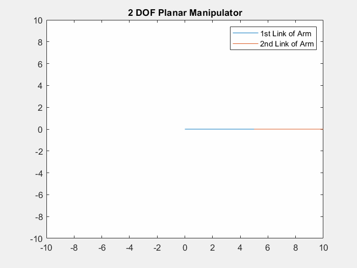

Author: Yash Bansod  
GitHub: https://github.com/YashBansod  

This is the main program.

## Clear the environment and the command line

```matlab
clear;
clc;
close all;
```

## Add the directory containing relevant functions to the path variables

```matlab
addpath('./INV-functions/')
```

## Define the input parameters and simulate

```matlab
% Set the length of the links of the manipulator robot.
L1 = 5;
L2 = 5;

% This function will take desired end-effector position from user via mouse 
% pointer. Select a point using the mouse and then press Enter.
% [expPoint, Joint] = INV_KIN_2DOF(L1,L2);

% Alternatively, user can choose to pass the desired end-effector position
% directly as absolute coordinates too.
expX = 5;
expY = 7;
[expPoint, Joint] = INV_KIN_2DOF(L1, L2, expX, expY);

fprintf("The final end effector position is (%0.2f, %0.2f)\n", expPoint);
[m, n] = size(Joint);
currPoint = [Joint(m,1); Joint(m,2)];
dist = sqrt((expPoint(1,1) - currPoint(1,1))^2 + ...
            (expPoint(2,1)-currPoint(2,1))^2 );

msgbox('Operation Complete')
```

## Results
<div class="table-wrapper">
<table class="alt">
   <tr>
      <td><div><span class="image fit"></span></div></td>
      <td><div><span class="image fit"></span></div></td>
   </tr>
</table> 
</div> 


The selected point for end effector is (5.00, 7.00)
The final end effector position is (5.00, 7.00)

<div class="table-wrapper">
<table class="alt">
  <tr>
    <td><div><span class="image fit"></span></div></td>
    <td><div><span class="image fit"></span></div></td>
   </tr> 
</table>
</div>  
  
