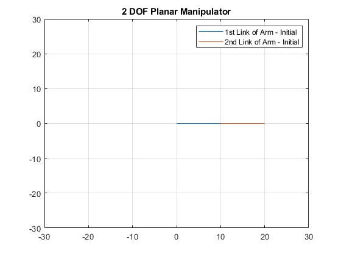

Author: Yash Bansod  
GitHub: https://github.com/YashBansod  

This is the main program.

## Clear the environment and the command line

```matlab
clear;
clc;
close all;
```

## Define the input parameters and simulate

```matlab
% Set the length of the links of the manipulator robot.
L1 = 10;
L2 = 10;

% Define the initial end-effector position (This should be reachable)
X = 20;
Y = 0;
```

## Compute the inverse algebraic solution for the initial position

```matlab
C2 = (X^2 + Y^2 - L1^2 -L2^2)/(2 * L1 * L2);
S2 = sqrt(1-C2^2);

theta2 = atan2(S2, C2);

K1 = L1 + L2* cos(theta2);
K2 = L2 * sin(theta2);
theta1 = atan2(Y, X) - atan2(K2, K1);

X1 = L1*cos(theta1);
Y1 = L1*sin(theta1);

X2 = L1*cos(theta1) + L2*cos(theta1 + theta2);
Y2 = L1*sin(theta1) + L2*sin(theta1 + theta2);

plot([0, X1], [0,Y1]);
hold on;
grid on;
plot([X1,X2], [Y1, Y2]);
title('2 DOF Planar Manipulator');
legend('1st Link of Arm - Initial', '2nd Link of Arm - Initial');
axis([-30 30 -30 30]);

% Take desired end-effector position from user via mouse pointer.
% [X,Y] = ginput;
% X = X(end);
% Y = Y(end);

% Alternatively, user can choose the desired end-effector position
% directly as absolute coordinates too.
X = 5;
Y = 7;

fprintf("The selected point for end effector is (%0.2f, %0.2f)\n", [X, Y])
if hypot(X, Y) > L1 + L2
    error("Point out of reach");
end
```

The selected point for end effector is (5.00, 7.00)

<div><span class="image fit"></span></div>

## Compute the inverse algebraic solution for the final position

```matlab
C2 = (X^2 + Y^2 - L1^2 -L2^2)/(2 * L1 * L2);
S2 = sqrt(1-C2^2);

theta2 = atan2(S2, C2);

K1 = L1 + L2* cos(theta2);
K2 = L2 * sin(theta2);
theta1 = atan2(Y, X) - atan2(K2, K1);

X1 = L1*cos(theta1);
Y1 = L1*sin(theta1);

X2 = L1*cos(theta1) + L2*cos(theta1 + theta2);
Y2 = L1*sin(theta1) + L2*sin(theta1 + theta2);

plot([0, X1], [0,Y1]);
plot([X1,X2], [Y1, Y2]);
legend('1st Link of Arm - Initial', '2nd Link of Arm - Initial', ...
    '1st Link of Arm - Final', '2nd Link of Arm - Final');
hold off;

fprintf("The final end effector position is (%0.2f, %0.2f)\n", [X2,Y2]);
```

The final end effector position is (5.00, 7.00)

<div><span class="image fit"></span></div>