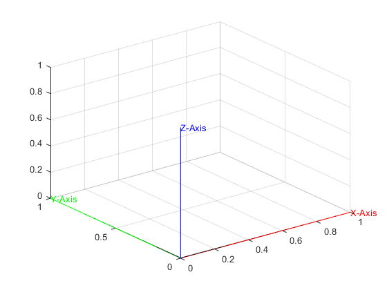
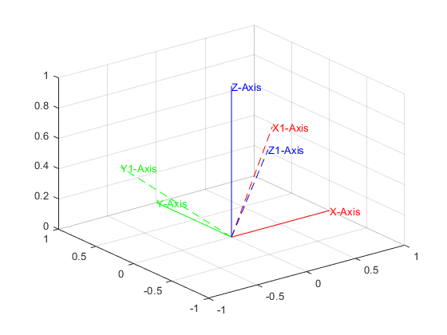
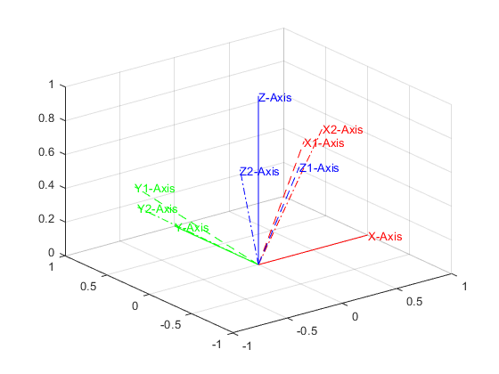

Author: Yash Bansod  
Date: 30th January, 2020  
GitHub: https://github.com/YashBansod  


#### Clear the environment and the command line

```matlab
clear;
clc;
```


#### Define some initial parameters

```matlab
% Define the origin coordinates
o_x = 0;
o_y = 0;
o_z = 0;

% Define the rotation across various axes
theta_x = 30;
theta_y = 30;
theta_z = 30;
```


#### Plot the Reference frame

```matlab
% Plot X axis
X = plot3([o_x, o_x + 1], [o_y, o_y], [o_z, o_z], '-', 'color', 'red');
grid on;
hold on;

% Plot Y axis
Y = plot3([o_x, o_x], [o_y, o_y + 1], [o_z, o_z], '-', 'color', 'green');

% Plot Z axis
Z = plot3([o_x, o_x], [o_y, o_y], [o_z, o_z + 1], '-', 'color', 'blue');

% Add text tags to the ends of the axes
text_x = text(o_x + 1, o_y, o_z, 'X-Axis', 'color', 'red');
text_y = text(o_x, o_y + 1, o_z, 'Y-Axis', 'color', 'green');
text_z = text(o_x, o_y, o_z + 1, 'Z-Axis', 'color', 'blue');
```

<div><span class="image fit"></span></div>


#### Calculate the rotation matrix

```matlab
% Counter-Clockwise Rotation across X axis
Rx = [  1,                  0 ,                 0;
        0,                  cosd(theta_x),      -sind(theta_x);
        0,                  sind(theta_x),      cosd(theta_x)];
    
% Couter-Clockwise Rotation across Y axis
Ry = [  cosd(theta_y),      0,                  -sind(theta_y);
        0,                  1,                  0;           
        sind(theta_y),      0,                  cosd(theta_y)];
    
% Couter-Clockwise Rotation across Z axis
Rz = [  cosd(theta_z),      -sind(theta_z),     0;
        sind(theta_z),      cosd(theta_z),      0;
        0,                  0,                  1];
```


#### Calculate Overall Rotation matrix

```matlab
% Rotation Matrix 1 = Rotation across X followed by Y followed by Z axis
R_1 = Rz * Ry * Rx;

% Rotation Matrix 2 = Rotation across Z followed by Y followed by X axis
R_2 = Rx * Ry * Rz;
```


#### Plot the Frame after applying Rotation Matrix 1 to Reference Frame

```matlab
X_1 = plot3([o_x, o_x + R_1(1, 1)], [o_y, o_y + R_1(2, 1)], [o_z, o_z + R_1(3, 1)], '--', 'color', 'red');
Y_1 = plot3([o_x, o_x + R_1(1, 2)], [o_y, o_y + R_1(2, 2)], [o_z, o_z + R_1(3, 2)], '--', 'color', 'green');
Z_1 = plot3([o_x, o_x + R_1(1, 3)], [o_y, o_y + R_1(2, 3)], [o_z, o_z + R_1(3, 3)], '--', 'color', 'blue');

text_x_1 = text(o_x + R_1(1, 1), o_y + R_1(2, 1), o_z + R_1(3, 1), 'X1-Axis', 'color', 'red');
text_y_1 = text(o_x + R_1(1, 2), o_y + R_1(2, 2), o_z + R_1(3, 2), 'Y1-Axis', 'color', 'green');
text_z_1 = text(o_x + R_1(1, 3), o_y + R_1(2, 3), o_z + R_1(3, 3), 'Z1-Axis', 'color', 'blue');
```

<div><span class="image fit"></span></div>

#### Plot the Frame after applying Rotation Matrix 2 to Reference Frame

```matlab
X_2 = plot3([o_x, o_x + R_2(1, 1)], [o_y, o_y + R_2(2, 1)], [o_z, o_z + R_2(3, 1)], '-.', 'color', 'red');
Y_2 = plot3([o_x, o_x + R_2(1, 2)], [o_y, o_y + R_2(2, 2)], [o_z, o_z + R_2(3, 2)], '-.', 'color', 'green');
Z_2 = plot3([o_x, o_x + R_2(1, 3)], [o_y, o_y + R_2(2, 3)], [o_z, o_z + R_2(3, 3)], '-.', 'color', 'blue');

text_x_2 = text(o_x + R_2(1, 1), o_y + R_2(2, 1), o_z + R_2(3, 1), 'X2-Axis', 'color', 'red');
text_y_2 = text(o_x + R_2(1, 2), o_y + R_2(2, 2), o_z + R_2(3, 2), 'Y2-Axis', 'color', 'green');
text_z_2 = text(o_x + R_2(1, 3), o_y + R_2(2, 3), o_z + R_2(3, 3), 'Z2-Axis', 'color', 'blue');
```

<div><span class="image fit"></span></div>
