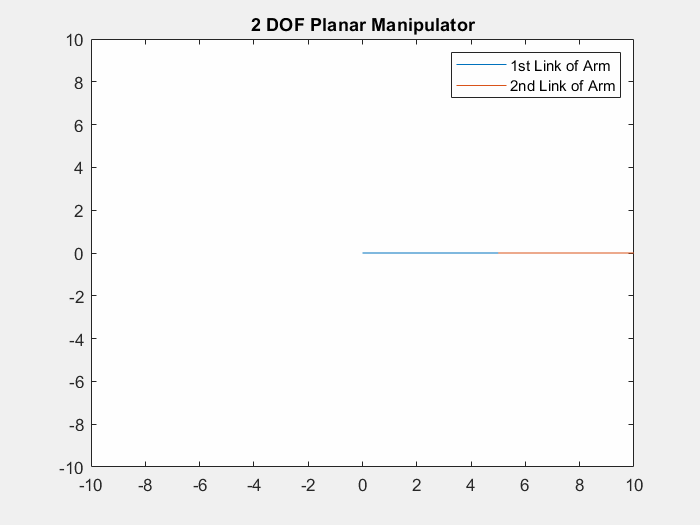

Author: Yash Bansod
GitHub: https://github.com/YashBansod

This is the main program.

## Clear the environment and the command line

```matlab
clear;
clc;
close all;
```

## Add the directory containing relevant functions to the path variables

```matlab
addpath('./INV-functions/')
```

## Define the input parameters

Set the length of the links of the manipulator robot.

```matlab
L1 = 5;
L2 = 5;

% This function will take desired manipulator position from user via mouse
% pointer. Select a point using the mouse and then press Enter.
% [expPoint, Joint] = INV_KIN_2DOF(L1,L2);

% Alternatively, user can choose to pass the desired manipulator position
% directly as absolute coordinates too.
expX = 5;
expY = 7;
[expPoint, Joint] = INV_KIN_2DOF(L1, L2, expX, expY);

fprintf("The final end effector position is (%0.2f, %0.2f)\n", expPoint);
[m, n] = size(Joint);
currPoint = [Joint(m,1); Joint(m,2)];
dist = sqrt((expPoint(1,1) - currPoint(1,1))^2 + ...
            (expPoint(2,1)-currPoint(2,1))^2 );

msgbox('Operation Complete')
```

## Results
<table>
   <tr>
      <td>  </td>
      <td>  </td>
   </tr>
</table>  


The selected point for end effector is (5.00, 7.00)
The final end effector position is (5.00, 7.00)

<table>
  <tr>
    <td>  </td>
    <td>  </td>
   </tr> 
</table>  
  