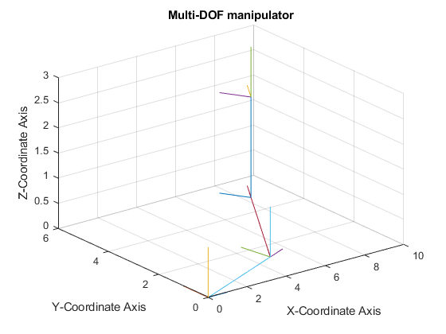
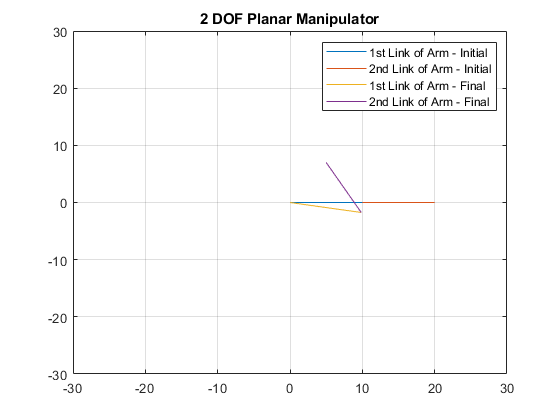
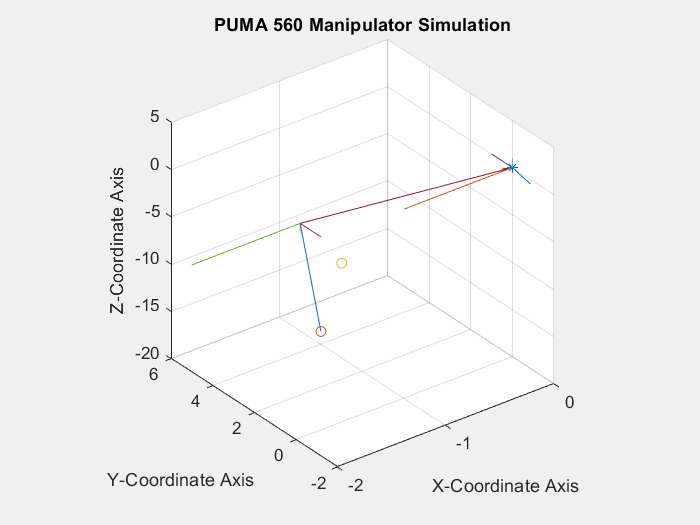

# [RPDC : Robotics-Planning-Dynamics-and-Control](https://github.com/YashBansod/Robotics-Planning-Dynamics-and-Control)
RPDC : This contains all my MATLAB codes for the Robotics, Planning, Dynamics and Control . The implementations model various kinds of manipulators and mobile robots for position control, trajectory planning and path planning problems.

GitHub Page: https://yashbansod.github.io/projects/Robotics-Planning-Dynamics-and-Control/

## Project Contents:  

The following are summarizing results from each of the sub-projects in this repository.  

<table class="alt">
  <tr>
    <td> 
        <a href="./1_Robot_Manipulator_and_Coordinates"><b>1_Robot_Manipulator_and_Coordinates</b></a>  
        

    </td>
    <td> 
        <a href="./2_2DOF_Manipulator_Inverse_Kinematics"><b>2_2DOF_Manipulator_Inverse_Kinematics</b></a>  
        

    </td>
  </tr> 
  <tr>
    <td> 
        <a href="./3_Inverse_Algebraic_Manipulator_Control"><b>3_Inverse_Algebraic_Manipulator_Control</b></a>  
        

    </td>
    <td> 
        <a href="./4_Planar_3DOF_Manipulator_Trajectory"><b>4_Planar_3DOF_Manipulator_Trajectory</b></a>  
        

    </td>
  </tr> 
  <tr>
    <td> 
        <a href="./5_PUMA560_Robot_Simulation"><b>5_PUMA560_Robot_Simulation</b></a>  
        

    </td>
    <td> 
        <a href="./6_Spring_Mass_Damper_System_Control"><b>6_Spring_Mass_Damper_System_Control</b></a>  
    </td>
  </tr> 
  <tr>
    <td> 
        <a href="./7_Dijkstra_Algorithm"><b>7_Dijkstra_Algorithm</b></a>  
        

    </td>
    <td> 
        <a href="./8_Astar_Algorithm"><b>8_Astar_Algorithm</b></a>  
        

    </td>
  </tr> 
  <tr>
    <td> 
        <a href="./Aux1_Rotation_Matrices"><b>Aux1_Rotation_Matrices</b></a>  
        

    </td>
    <td> 
    </td>
  </tr> 
</table>

